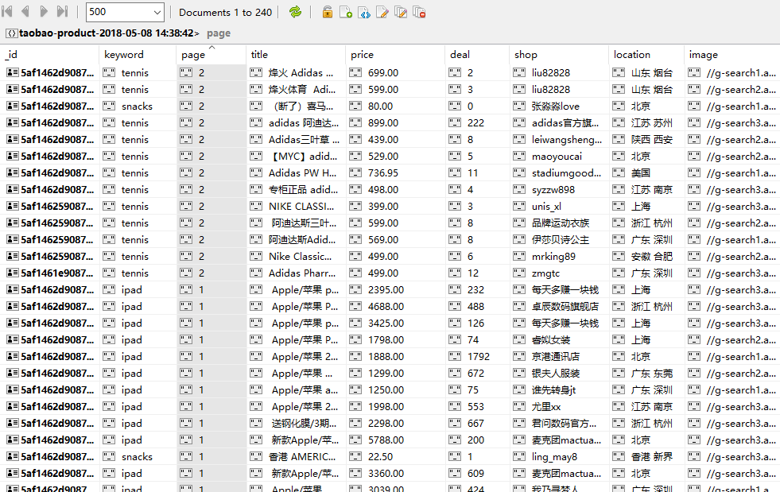

# Scrapy-selenium-taobao
This project is constructed to scrap commodity information from taobao.com based on Scrapy combined with Selenium.
## 1 Preparation
Make sure to install Python 3.6, Chrome, Chromedriver and MongoDB. 
Make sure to install the following libs: scrapy, selenium, pymongo.
## 2 Configuration
#### 2.1 Setup the Spider
    import scrapy
    from urllib.parse import quote
    from scrapy.loader import ItemLoader
    from scrapy_selenium_taobao.items import ProductItem
    from scrapy.loader.processors import Join

    class TaobaoSpider(scrapy.Spider):
        name = 'taobao'
        allowed_domains = ['taobao.com']
        base_url = 'https://s.taobao.com/search?q='

        def start_requests(self):
            for keyword in self.settings.get('KEYWORDS'):
                for page in range(1, self.settings.get('MAX_PAGE')+1):
                    url = self.base_url + quote(keyword)
                    yield scrapy.Request(url, callback=self.parse, meta={'keyword': keyword, 'page': page}, dont_filter=True)

        def parse(self, response):
            keyword = response.meta['keyword']
            page = response.meta['page']
            products = response.xpath('//div[@class="grid g-clearfix"]/div/div')
            for product in products:
                loader = ItemLoader(item=ProductItem())
                loader.default_output_processor = Join()
                loader.add_value('keyword', keyword)
                loader.add_value('page', str(page))
                loader.add_value('title', product.xpath('div[2]/div[2]/a/text()').extract())
                loader.add_value('price', product.xpath('.//*[contains(@class,"price")]/strong/text()').extract_first())
                loader.add_value('deal', product.xpath('.//*[@class="deal-cnt"]/text()').extract_first())
                loader.add_value('shop', product.xpath('.//*[@class="shop"]/a/span[2]/text()').extract_first())
                loader.add_value('location', product.xpath('.//*[@class="location"]/text()').extract_first())
                loader.add_value('image', product.xpath('.//img[contains(@class,"J_ItemPic")]/@data-src').extract_first())
                yield loader.load_item()
            self.logger.info('Page %s for %s was completed' % (page, keyword))
Create requests to scrap the webpages with differnt seaching keywords at different pages. All the requests are sent to SeleniumMiddleware for processing and sending back responses.
#### 2.2 Create SeleniumMiddleware
    from selenium import webdriver
    from selenium.webdriver.chrome.options import Options
    from selenium.common.exceptions import TimeoutException
    from logging import getLogger
    from scrapy.http import HtmlResponse
    import time

    class SeleniumMiddleware(object):
        def __init__(self):
            self.logger = getLogger(__name__)
            self.chrome_options = Options()
            self.chrome_options.add_argument('--headless')
            self.chrome_options.add_argument('--disable--gpu')
            self.driver = webdriver.Chrome(chrome_options=self.chrome_options)
            self.driver.maximize_window()
            self.driver.implicitly_wait(10)

        def __del__(self):
            self.driver.close()

        def process_request(self, request, spider):
            # scrap the webpage using headlesschrome
            self.logger.debug('Headlesschrome is starting')
            try:
                self.driver.get(request.url)
                self.driver.find_element_by_xpath('//div[@class="form"]/input').clear()
                self.driver.find_element_by_xpath('//div[@class="form"]/input').send_keys(request.meta['page'])
                self.driver.find_element_by_xpath('//div[@class="form"]/span[@role="button"]').click()
                time.sleep(5)
                return HtmlResponse(url=self.driver.current_url, status=200, body=self.driver.page_source, request=request, encoding='utf-8')
            except TimeoutException:
                return HtmlResponse(url=request.url, status=500, request=request)
This is the key step to combine Scrapy with Selenium. Here a SeleniumMiddleware is created to process the requet via Selenium and send back the response to Spider for parsing. In this case the request is no longer sent to the Downloader of Scrapy since when a process_request method return a response object, other process_request methods of DownloaderMiddlewares will not be called any more.
#### 2.3 Enable DOWNLOADER_MIDDLEWARES in settings.py
    DOWNLOADER_MIDDLEWARES = {
        'scrapy_selenium_taobao.middlewares.SeleniumMiddleware': 300,
    }
# 3 Running result
Items are stored in MongoDB like this:

# 4 Summary
When scraping the webpages dynamically renderd by JavaScript, Selenium is quite a useful tool since it can simulate the brower to visit the pages. At the same time, it's convenient to combine Selenium with Scrapy.